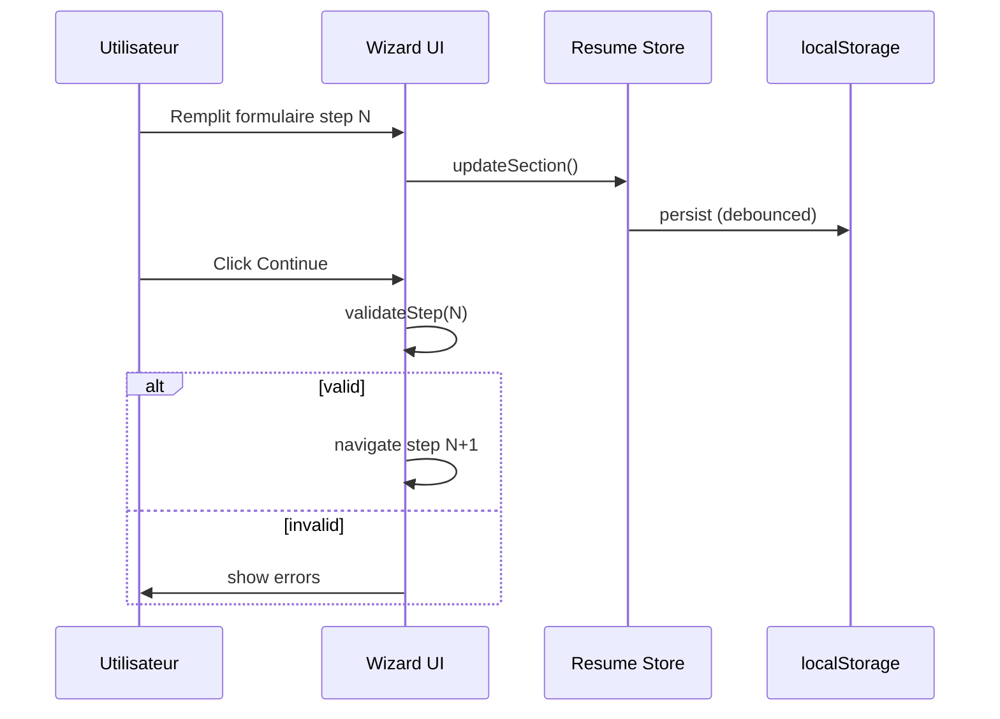
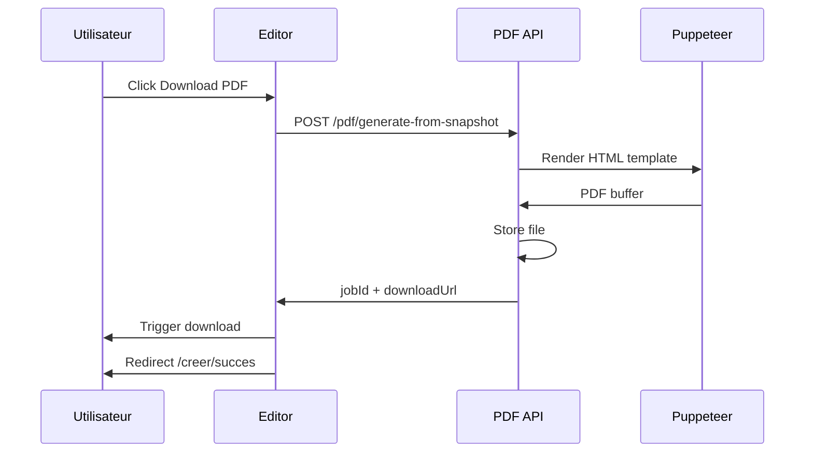

# 07 — Parcours Utilisateur Profilo'Z

> **Statut :** Document d'architecture — à valider avant implémentation

---

## 1. Vue d'ensemble des parcours

```
                    ┌─────────────┐
                    │   Landing   │
                    └──────┬──────┘
           ┌───────────────┼───────────────┐
           ▼               ▼               ▼
    ┌────────────┐  ┌────────────┐  ┌────────────┐
    │   Wizard   │  │ Import CV  │  │  Connexion │
    │  (manuel)  │  │ Diplôme/   │  │  (existant)│
    └─────┬──────┘  │ Attestation│  └─────┬──────┘
          │         └─────┬──────┘        │
          └───────────────┼───────────────┘
                          ▼
                   ┌─────────────┐
                   │   Modèle    │
                   └──────┬──────┘
                          ▼
                   ┌─────────────┐
                   │   Éditeur   │
                   │  + Preview  │
                   └──────┬──────┘
                          ▼
                   ┌─────────────┐
                   │  PDF Export │
                   └──────┬──────┘
                          ▼
                   ┌─────────────┐
                   │   Succès    │
                   │ Compte opt. │
                   └──────┬──────┘
                          ▼
                   ┌─────────────┐
                   │  Dashboard  │
                   └─────────────┘
```

---

## 2. Parcours A — Création manuelle (Wizard)

### 2.1 Point d'entrée

**Landing** → CTA « Créer mon CV » → `/creer/assistant/informations`

**Prérequis système :**
- Guest session créée automatiquement
- Resume draft initialisé en localStorage

### 2.2 Étapes

| Step | Route | Contenu | Validation | Action Continue |
|------|-------|---------|------------|-----------------|
| 1 | `/creer/assistant/informations` | Infos personnelles | Nom + email requis | → Step 2 |
| 2 | `/creer/assistant/formation` | Éducation | ≥ 1 entrée recommandée | → Step 3 |
| 3 | `/creer/assistant/experience` | Expériences | Optionnel étudiant | → Step 4 |
| 4 | `/creer/assistant/competences` | Compétences | ≥ 3 recommandées | → Step 5 |
| 5 | `/creer/assistant/certifications` | Certifications | Optionnel | → Step 6 |
| 6 | `/creer/assistant/interets` | Intérêts | Optionnel | → Modèles |

### 2.3 Diagramme séquence



### 2.4 Exit flow

- Click « Exit » → Modal confirmation
- Options : « Sauvegarder brouillon » / « Abandonner »
- Brouillon reste en localStorage

---

## 3. Parcours B — Import CV

### 3.1 Point d'entrée

**Landing** → « Importer un CV existant » → `/creer/importer/cv`

### 3.2 Étapes

| Phase | UI | Backend |
|-------|-----|---------|
| 1. Upload | FileDropZone | POST /documents/upload |
| 2. Processing | ExtractionProgress | POST /documents/:id/process |
| 3. Preview | ExtractedPreview cards | GET /documents/:id/ocr-result |
| 4. Correction | Edit toggles inline | — (client-side) |
| 5. Confirm | « Confirmer et continuer » | POST /resumes/:id/merge-import |
| 6. Suite | → Choix modèle | — |

### 3.3 Formats acceptés

- PDF (natif ou scanné)
- DOCX
- JPG/PNG (photo scan)

### 3.4 Gestion erreurs

| Erreur | Message FR | Action |
|--------|------------|--------|
| File too large | Fichier trop volumineux (max 10 Mo) | Retry |
| Invalid MIME | Format non supporté | Retry |
| OCR failed | Impossible d'extraire le texte | Saisie manuelle |
| Low confidence | Extraction partielle — vérifiez les champs | Correction |

---

## 4. Parcours C — Import Diplôme

**Route :** `/creer/importer/diplome`

**Différences vs CV :**
- Type document = `DIPLOMA`
- Preview priorise section Education
- Merge strategy = `append` to educations
- UI label : « Importer un diplôme »

**Flow identique** upload → OCR → correction → merge → modèle

---

## 5. Parcours D — Import Attestation

**Route :** `/creer/importer/attestation`

**Différences :**
- Type = `CERTIFICATE`
- Preview priorise Certifications
- Merge → certifications array

---

## 6. Parcours E — Choix modèle

**Route :** `/creer/modele`

**Accès depuis :**
- Fin wizard
- Post-import confirm
- Dashboard → Templates
- Landing templates section

### 6.1 Actions

| Action | Résultat |
|--------|----------|
| Filter category | Client-side filter |
| Hover preview | Overlay « Aperçu instantané » |
| Select Template | Set templateSlug → navigate editor |
| Search | Filter by name |

### 6.2 Mapping catégories FR

| Filtre UI | Templates |
|-----------|-----------|
| Tous | 10 modèles |
| Professionnel | Professionnel, Manager, Premium |
| Créatif | Moderne, Créatif |
| Débutant | Étudiant, Minimaliste |
| Technique | Développeur, Commercial, International |

---

## 7. Parcours F — Éditeur & Preview

**Route :** `/creer/editeur`

### 7.1 Layout

- Left sidebar 360px : template, colors, typography, settings
- Right : A4 live preview
- Topbar : project name, download PDF, edit content link

### 7.2 Actions

| Action | Comportement |
|--------|--------------|
| Change template | Hot swap preview component |
| Change accent | CSS variable update |
| Adjust margins | Preview + PDF config |
| Edit Content | → Retour wizard ou modal inline |
| Download PDF | POST /pdf/generate → poll → download |
| Zoom | Client-only scale |

### 7.3 Auto-save

- Guest : localStorage every 500ms debounce
- Auth : PATCH /resumes/:id debounced

---

## 8. Parcours G — Génération PDF & Succès

### 8.1 Génération



### 8.2 Page Succès

**Route :** `/creer/succes`

| Élément | Action |
|---------|--------|
| Confetti | Animation auto |
| Create Account | → `/inscription?email=...` |
| Continue as Guest | → Landing ou Dashboard limité |
| PDF chip | Re-download |

---

## 9. Parcours H — Inscription optionnelle

**Trigger :** Post-PDF success

**Route :** `/inscription`

### 9.1 Flow

1. Email pré-rempli (si collecté wizard)
2. Password + confirm
3. Submit → POST /auth/register + migrate
4. Success state → redirect dashboard

### 9.2 Migration data

- Resume draft → Resume DB record
- Documents guest → user documents
- Guest session invalidated

---

## 10. Parcours I — Connexion

**Route :** `/connexion`

**Entrées :**
- Landing « Se connecter »
- Signup page link
- Middleware redirect

**Post-login :** → `/tableau-de-bord`

---

## 11. Parcours J — Dashboard

**Route :** `/tableau-de-bord`

### 11.1 Actions principales

| Action | Destination |
|--------|-------------|
| New Resume | `/creer` (choix parcours) |
| Edit resume | `/creer/editeur?id=...` |
| Duplicate | API + refresh grid |
| Download | PDF API |
| View templates | `/tableau-de-bord/modeles` |
| Documents history | `/tableau-de-bord/documents` |
| Cover letters | `/tableau-de-bord/lettres` |

### 11.2 États vides

| Section | Empty state |
|---------|-------------|
| No resumes | Ghost card « Créer un CV » |
| No documents | Illustration + CTA import |
| No letters | CTA create letter |

---

## 12. Parcours K — Lettre de motivation

**Route :** `/tableau-de-bord/lettres`

**Prérequis :** Compte authentifié

### 12.1 Flow

1. Remplir formulaire (entreprise, poste, contenu)
2. Preview live letterhead
3. Copy / Download PDF
4. Save → POST /cover-letters

**V1 :** Pas de génération automatique. Templates de texte suggérés (static).

---

## 13. Parcours L — Choix parcours initial

**Route :** `/creer` (écran manquant — à ajouter)

**Options :**

| Carte | Route |
|-------|-------|
| Créer manuellement | `/creer/assistant/informations` |
| Importer un CV | `/creer/importer/cv` |
| Importer un diplôme | `/creer/importer/diplome` |
| Importer une attestation | `/creer/importer/attestation` |

---

## 14. Matrice Guest vs Authenticated

| Fonctionnalité | Guest | Authenticated |
|----------------|-------|---------------|
| Wizard complet | ✅ localStorage | ✅ + API sync |
| Import OCR | ✅ guest session | ✅ |
| Template select | ✅ | ✅ |
| PDF download | ✅ (TTL 24h) | ✅ permanent |
| Save multiple CVs | ❌ (1 draft) | ✅ |
| Dashboard | ❌ | ✅ |
| Cover letters | ❌ | ✅ |
| Document history | ❌ session only | ✅ |
| Duplicate CV | ❌ | ✅ |

---

## 15. Règles de navigation

| Règle | Implémentation |
|-------|----------------|
| Wizard steps sequential | Middleware guard |
| Can't skip to editor without min data | Name + email required |
| Can't PDF without template | templateSlug required |
| Auth routes protected | auth middleware |
| Guest can't access dashboard | Redirect to signup |

---

## 16. Notifications & feedback

| Event | Feedback |
|-------|----------|
| Save success | Toast discret / status bar |
| Save error | Toast error + retry |
| Upload progress | Progress bar |
| OCR complete | Badge « Analyse terminée » |
| PDF ready | Toast + auto download |
| Account created | Success animation |

---

## 17. Parcours edge cases

| Cas | Comportement |
|-----|--------------|
| Refresh mid-wizard | Restore from localStorage |
| Browser change (guest) | Data lost — warn user |
| OCR partial | Highlight empty fields |
| PDF timeout | Retry button |
| Session expired | Re-create guest session |
| Duplicate email signup | Error message + login link |

---

## 18. Métriques par parcours

| Parcours | Event analytics (V2) |
|----------|---------------------|
| Landing view | `page_view` |
| CTA click | `start_creation` |
| Wizard step complete | `wizard_step_N` |
| Import success | `import_complete` |
| Template selected | `template_selected` |
| PDF downloaded | `pdf_generated` |
| Account created | `signup_complete` |
